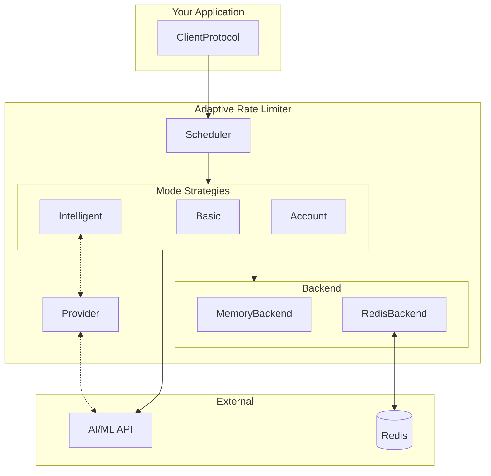

<p align="center">
  
</p>

# Adaptive Rate Limiter

A provider-agnostic, adaptive rate limiting library for AI/ML APIs with intelligent scheduling, streaming support, and distributed backends.

[](https://www.python.org/downloads/)
[](https://opensource.org/licenses/Apache-2.0)
[](https://pypi.org/project/adaptive-rate-limiter/)
[](https://github.com/sethbang/adaptive-rate-limiter/actions/workflows/ci.yml)
[](https://codecov.io/gh/sethbang/adaptive-rate-limiter)


## Features

- **Provider-Agnostic**: Works with any OpenAI-compatible API (OpenAI, Anthropic, Venice, Groq, Together, etc.)
- **Adaptive Strategies**: Intelligent rate limit discovery from response headers
- **Streaming Support**: Refund-based token accounting for streaming responses
- **Distributed Backends**: MemoryBackend for single instances, RedisBackend for distributed deployments
- **Multiple Scheduling Modes**: Basic, Intelligent, and Account-level strategies
- **Observability**: Built-in Prometheus metrics collection
- **Multi-Tenant**: Namespace-based isolation for multi-tenant applications

## Installation

```bash
pip install adaptive-rate-limiter
```

Or using uv:

```bash
uv add adaptive-rate-limiter
# or
uv pip install adaptive-rate-limiter
```

### Optional Dependencies

```bash
# For Redis distributed backend
pip install adaptive-rate-limiter[redis]

# For Prometheus metrics
pip install adaptive-rate-limiter[metrics]

# For all optional dependencies
pip install adaptive-rate-limiter[full]
```

For development:

```bash
git clone https://github.com/sethbang/adaptive-rate-limiter.git
cd adaptive-rate-limiter
pip install -e ".[dev]"
```

## Quick Start

```python
from adaptive_rate_limiter import (
    ClientProtocol,
    ProviderInterface,
    DiscoveredBucket,
    RateLimitInfo,
    TEXT,
)
from adaptive_rate_limiter.scheduler import create_scheduler, RateLimiterConfig

# Implement the required ClientProtocol
class MyClient(ClientProtocol):
    @property
    def base_url(self) -> str:
        return "https://api.example.com"

    @property
    def timeout(self) -> float:
        return 30.0

    def get_headers(self) -> dict:
        return {"Authorization": "Bearer ..."}

# Create a scheduler with your client
client = MyClient()
scheduler = create_scheduler(
    client=client,  # Required
    mode="intelligent",  # "basic" | "intelligent" | "account"
    config=RateLimiterConfig(
        max_concurrent_executions=100,
        max_queue_size=1000,
    ),
)

# Submit a request through the scheduler
from adaptive_rate_limiter import TEXT, RequestMetadata

async def make_request():
    async with scheduler:
        metadata = RequestMetadata(
            request_id="req-12345",
            model_id="venice-uncensored",
            resource_type=TEXT,
            estimated_tokens=1000,
        )
        result = await scheduler.submit_request(
            metadata=metadata,
            request_func=my_api_call,
        )
    return result
```

## Key Concepts

### Providers

Providers define how rate limits are discovered and parsed from API responses. Implement the `ProviderInterface`:

```python
from typing import Dict, Optional, Any
from adaptive_rate_limiter import ProviderInterface, DiscoveredBucket, RateLimitInfo

class MyProvider(ProviderInterface):
    """Custom provider for your API."""

    @property
    def name(self) -> str:
        """Unique provider name."""
        return "my-provider"

    async def discover_limits(
        self,
        force_refresh: bool = False,
        timeout: float = 30.0,
    ) -> Dict[str, DiscoveredBucket]:
        """Discover available rate limits."""
        return {
            "default": DiscoveredBucket(
                bucket_id="default",
                rpm_limit=100,
                tpm_limit=100000,
            )
        }

    def parse_rate_limit_response(
        self,
        headers: Dict[str, str],
        body: Optional[Dict[str, Any]] = None,
        status_code: Optional[int] = None,
    ) -> RateLimitInfo:
        """Parse rate limit headers from API response."""
        return RateLimitInfo(
            rpm_remaining=int(headers.get("x-ratelimit-remaining-requests", 0)),
            rpm_limit=int(headers.get("x-ratelimit-limit-requests", 0)),
            tpm_remaining=int(headers.get("x-ratelimit-remaining-tokens", 0)),
            tpm_limit=int(headers.get("x-ratelimit-limit-tokens", 0)),
            is_rate_limited=(status_code == 429),
        )

    async def get_bucket_for_model(
        self,
        model_id: str,
        resource_type: Optional[str] = None,
    ) -> str:
        """Get bucket ID for a model."""
        return "default"
```

### Backends

Backends handle rate limit state storage. Choose based on your deployment:

#### MemoryBackend

For single-instance deployments:

```python
from adaptive_rate_limiter.backends import MemoryBackend

backend = MemoryBackend()
```

#### RedisBackend

For distributed deployments with multiple instances:

```python
from adaptive_rate_limiter.backends import RedisBackend
import redis.asyncio as redis

redis_client = redis.Redis(host="localhost", port=6379)
# RedisBackend takes redis_url as first positional arg, redis_client as optional keyword
backend = RedisBackend(redis_client=redis_client, namespace="my-app")
# Or use URL-based initialization (redis_url is first positional param):
# backend = RedisBackend("redis://localhost:6379", namespace="my-app")
```

### Scheduling Modes

The library supports three scheduling modes, each with different trade-offs:

#### Basic Mode

Simple direct execution with retry logic. Best for low-volume use cases:

```python
from adaptive_rate_limiter.scheduler import create_scheduler

scheduler = create_scheduler(
    client=client,
    mode="basic",
)
```

#### Intelligent Mode

Advanced queuing with bucket-based scheduling and rate limit discovery. Recommended for production:

```python
scheduler = create_scheduler(
    client=client,
    mode="intelligent",
    provider=my_provider,  # Optional: ProviderInterface for rate limit discovery
    classifier=my_classifier,  # Optional: ClassifierProtocol for request classification
)
```

#### Account Mode

Account-level request management for multi-tenant applications:

```python
scheduler = create_scheduler(
    client=client,
    mode="account",
)
```

### Streaming Support

The library automatically handles streaming responses with refund-based token accounting:

```python
from adaptive_rate_limiter import TEXT, RequestMetadata

async def stream_request():
    async with scheduler:
        metadata = RequestMetadata(
            request_id="stream-12345",
            model_id="venice-uncensored",
            resource_type=TEXT,
            estimated_tokens=1000,
        )
        stream = await scheduler.submit_request(
            metadata=metadata,
            request_func=my_streaming_api_call,
        )
        async for chunk in stream:
            yield chunk
        # Token accounting automatically adjusted when stream completes
```

### Resource Types

The library provides predefined resource type constants:

```python
from adaptive_rate_limiter import TEXT, IMAGE, AUDIO, EMBEDDING, GENERIC

# Use predefined constants
resource_type = TEXT

# Or use custom strings
resource_type = "custom-resource"
```

## Configuration

The `RateLimiterConfig` class provides configuration options:

```python
from adaptive_rate_limiter.scheduler import RateLimiterConfig

config = RateLimiterConfig(
    # Core scheduling
    max_concurrent_executions=100,  # Default: 100
    max_queue_size=1000,  # Default: 1000

    # Request processing
    request_timeout=30.0,  # Default: 30.0

    # Rate limiting
    rate_limit_buffer_ratio=0.9,  # Use 90% of limit (default: 0.9)
)
```

### State Configuration

For advanced state management:

```python
from adaptive_rate_limiter.scheduler import StateConfig, CachePolicy

state_config = StateConfig(
    cache_policy=CachePolicy.WRITE_THROUGH,  # Recommended for production (durability)
    namespace="my-app",
    is_production=True,  # Enable production safety checks
)
```

## Observability

### Prometheus Metrics

The library includes built-in Prometheus metrics via `prometheus-client`:

```python
# Metrics are automatically exposed when using the scheduler
# Access via your Prometheus metrics endpoint
```

## Exception Handling

The library provides a comprehensive exception hierarchy:

```python
from adaptive_rate_limiter import (
    RateLimiterError,        # Base exception
    CapacityExceededError,   # Rate limit exceeded
    BucketNotFoundError,     # Unknown bucket
    ReservationCapacityError,# Reservation tracker full
    BackendConnectionError,  # Backend connection failed
    BackendOperationError,   # Backend operation failed
    ConfigurationError,      # Invalid configuration
    QueueOverflowError,      # Queue full
    TooManyFailedRequestsError, # Circuit breaker tripped
)

async def handle_request():
    try:
        result = await scheduler.submit_request(metadata, request_func)
    except CapacityExceededError as e:
        print(f"Rate limited on bucket {e.bucket_id}")
        print(f"Retry after {e.retry_after} seconds")
    except BucketNotFoundError as e:
        print(f"Unknown bucket: {e.bucket_id}")
    except RateLimiterError as e:
        print(f"Rate limiter error: {e}")
```

## API Reference

### Main Package Exports

```python
from adaptive_rate_limiter import (
    # Exceptions
    RateLimiterError, CapacityExceededError, BucketNotFoundError,
    ReservationCapacityError, BackendConnectionError, BackendOperationError,
    ConfigurationError, QueueOverflowError, TooManyFailedRequestsError,

    # Protocols
    ClientProtocol, ClassifierProtocol, RequestMetadata,
    StreamingResponseProtocol, ProviderInterface,

    # Types
    DiscoveredBucket, RateLimitInfo, ReservationContext, ReservationTracker,
    ResourceType, RESOURCE_TYPES,

    # Resource type constants
    TEXT, IMAGE, AUDIO, EMBEDDING, GENERIC,

    # Streaming
    StreamingReservationContext, RateLimitedAsyncIterator,
)
```

### Scheduler Submodule

```python
from adaptive_rate_limiter.scheduler import (
    Scheduler, create_scheduler, RateLimiterConfig, StateConfig,
    SchedulerMode, CachePolicy,
)
```

### Backends Submodule

```python
from adaptive_rate_limiter.backends import BaseBackend, MemoryBackend, RedisBackend
```

## Architecture



## API Stability

This library follows [Semantic Versioning 2.0.0](https://semver.org/).

### Public API

The public API consists of all symbols exported from:
- [`adaptive_rate_limiter/__init__.py`](src/adaptive_rate_limiter/__init__.py) (main package exports)
- [`adaptive_rate_limiter/scheduler/__init__.py`](src/adaptive_rate_limiter/scheduler/__init__.py) (scheduler submodule)
- [`adaptive_rate_limiter/backends/__init__.py`](src/adaptive_rate_limiter/backends/__init__.py) (backends submodule)

These exports are documented in the [API Reference](#api-reference) section above.

### Internal APIs

Modules, classes, and functions prefixed with `_` (single underscore) are internal implementation details. The [`_internal/`](src/adaptive_rate_limiter/_internal/) package and any `_`-prefixed names are explicitly not part of the public API and may change without notice between any versions.

### Deprecation Policy

- Deprecated features will emit `DeprecationWarning` for at least one minor version before removal
- Deprecation notices will be documented in the [CHANGELOG](CHANGELOG.md)
- Breaking changes to public APIs will only occur in major version releases (e.g., 1.x → 2.0)

## Documentation

Full documentation is available in the [docs/](docs/) directory:

- [Quick Start](docs/quickstart.mdx) - Get started quickly
- [Configuration](docs/configuration.mdx) - All configuration options
- [Backends](docs/backends.mdx) - Memory and Redis backends
- [Providers](docs/providers.mdx) - Custom provider integration
- [Streaming](docs/streaming.mdx) - Streaming response handling
- [Observability](docs/observability.mdx) - Metrics and monitoring
- [Exceptions](docs/exceptions.mdx) - Exception hierarchy
- [Reservation Tracking](docs/reservation-tracking.mdx) - Orphan detection

## Contributing

We welcome contributions! Please see our [Contributing Guidelines](CONTRIBUTING.md) for details on how to get started.

For security-related issues, please review our [Security Policy](SECURITY.md).

## License

Apache-2.0 License - see [LICENSE](LICENSE) for details.
