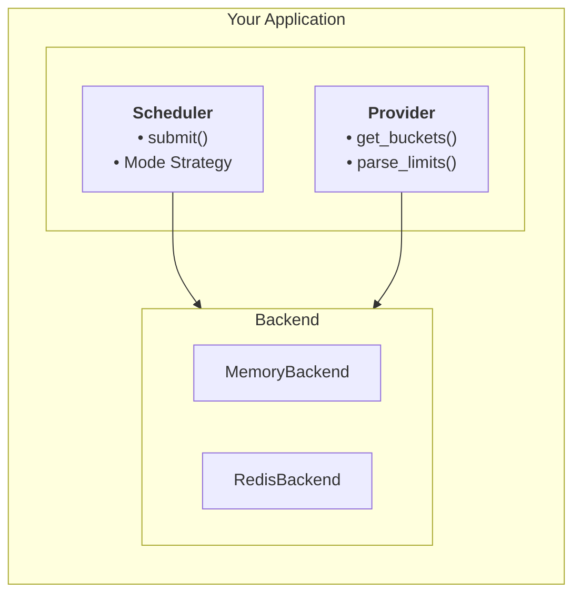

<p style={{display: 'flex', gap: '8px', flexWrap: 'wrap'}}>
  
  
  
</p>

## Overview

The Adaptive Rate Limiter is designed to handle the complex rate limiting requirements of modern AI APIs. It goes beyond simple token buckets by actively discovering rate limits from API responses, managing distributed state across multiple instances, and providing first-class support for streaming responses.

<Card title="Get Started" icon="rocket" href="/quickstart">
  Install the library and run your first rate-limited request in minutes.
</Card>

## Key Features

- **Provider-Agnostic**: Works with any OpenAI-compatible API (OpenAI, Anthropic, Venice, Groq, Together, etc.)
- **Adaptive Strategies**: Intelligent rate limit discovery from response headers
- **Streaming Support**: Automatic reservation tracking for streaming responses with refund-based accounting
- **Distributed Backends**: In-memory for single instances, Redis for distributed deployments
- **Multiple Scheduling Modes**: Basic, Intelligent, and Account-level strategies
- **Observability**: Built-in Prometheus metrics collection
- **Type-Safe**: Full typing with protocols and Pydantic models

## Quick Start

```python
from adaptive_rate_limiter import (
    ProviderInterface,
    DiscoveredBucket,
    RateLimitInfo,
    ReservationContext,
    RequestMetadata,
    TEXT,
)

# Define your provider
class MyProvider(ProviderInterface):
    # ... implement required methods
    pass

# Create a reservation context for tracking
reservation = ReservationContext(
    reservation_id="req-abc123",      # unique ID for this reservation
    bucket_id="openai/gpt-5/tokens",  # rate limit bucket identifier
    estimated_tokens=1500,            # tokens reserved for this request
)

# Use with scheduler to make rate-limited requests
async def make_request():
    metadata = RequestMetadata(
        request_id="unique-request-id",
        resource_type=TEXT,
        estimated_tokens=1000,
    )
    response = await scheduler.submit_request(metadata, request_func)
```

See the [Quick Start Guide](quickstart) for complete examples.

## Public API

The library exports 30+ public symbols. Here are the key imports:

```python
from adaptive_rate_limiter import (
    # Core - Scheduler
    Scheduler, create_scheduler, RateLimiterConfig,

    # Core - Protocols
    ClientProtocol, RequestMetadata,

    # Providers
    ProviderInterface, DiscoveredBucket, RateLimitInfo,

    # Exceptions
    RateLimiterError, CapacityExceededError, BucketNotFoundError,

    # Resource Types
    TEXT, IMAGE, AUDIO, EMBEDDING, GENERIC,
)

# Subpackage imports
from adaptive_rate_limiter.scheduler import SchedulerMode, StateConfig, CachePolicy
from adaptive_rate_limiter.backends import MemoryBackend, RedisBackend
from adaptive_rate_limiter.streaming import StreamingReservationContext
from adaptive_rate_limiter.reservation import ReservationContext, ReservationTracker
```

## Explore the Docs

<CardGroup cols={2}>
  <Card title="Quick Start" icon="rocket" href="/quickstart">
    Installation and basic usage
  </Card>
  <Card title="Configuration" icon="gear" href="/configuration">
    49 configuration options
  </Card>
  <Card title="Backends" icon="database" href="/backends">
    Memory and Redis state storage
  </Card>
  <Card title="Providers" icon="plug" href="/providers">
    Custom AI provider integration
  </Card>
  <Card title="Streaming" icon="wave-sine" href="/streaming">
    Streaming response support
  </Card>
  <Card title="Reservations" icon="ticket" href="/reservation-tracking">
    Reservation tracking system
  </Card>
  <Card title="Exceptions" icon="circle-exclamation" href="/exceptions">
    Error handling patterns
  </Card>
  <Card title="Observability" icon="chart-line" href="/observability">
    Prometheus metrics
  </Card>
</CardGroup>

## Architecture

The library uses a scheduler-based architecture where requests are submitted to a scheduler which manages queues, rate limits, and execution.



## License

This project is licensed under the Apache-2.0 License - see the [LICENSE](https://github.com/sethbang/adaptive-rate-limiter/blob/main/LICENSE) file for details.
